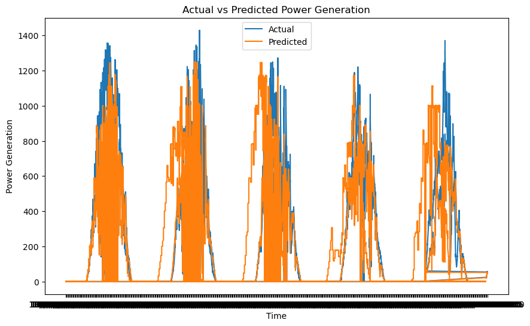
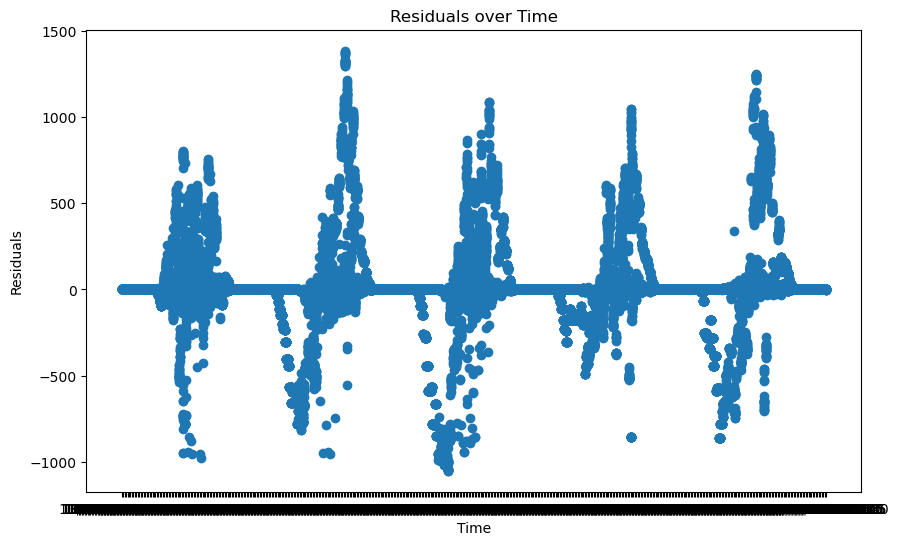

# PROJECT TITLE 
Predicting Solar Power Generation

## NON-TECHNICAL EXPLANATION OF YOUR PROJECT
Using sensor data gathered at a plant level, the goal is to predict the power generation at the solar plant over the forthcoming days.
This forecast will be derived from historical generation data and sensor readings from two distinct power stations. This is a regression problem. 
In this scenario, the requirement is to predict a continuous output (A specific numeric quantity (the amount of power generated by the power generation of the solar plant)) based on a set of input features (AC, DC, Yield, ambient temperature, module temperature, and irradiation).

## DATA
A power generation set of data and a sensor set of data produced by two solar panel generation
plants in India are provided. The power generation datasets are gathered at the inverter level where
each inverter has multiple lines of solar panels attached to it. The data is in CSV format so is straight forward to work with. 
It consists of 140,000 rows of generation information. Here is the data definition from the source :
“This data has been gathered at two solar power plants in India over a 34 day period. It has two pairs
of files - each pair has one power generation dataset and one sensor readings dataset. The power
generation datasets are gathered at the inverter level - each inverter has multiple lines of solar
panels attached to it. The sensor data is gathered at a plant level - single array of sensors optimally
placed at the plant.” - ANI KANNAL, KAGGLE. 

Two models were used in the project, the purpose of which was to find the most suitable model to build, starting with simple foundations to more complex analysis. 
The first model used is a linear regression statistical model. It is a basic predictive
statistical model that assumes a linear relationship between independent (input) variables and a
dependent (output) variable. It doesn't inherently account for the time-dependent structure of the
solar data. However, it can be used in time series forecasting if the relationship between input and
output variables is indeed linear and if the features are engineered in such a way that they capture
the dependencies (for instance, by using lagged values of variables as inputs), all of which is
explored in this project.
The second model used is a Random Forest model. It is a machine learning model that uses decision
trees to make predictions. Unlike linear regression, it doesn't assume a linear relationship between
input and output variables, and it can capture complex interactions between variables. For this
project it will be used for regression. As it is typically more powerful than linear regression, it is also
more complex and can be harder to interpret. This model will be used once the linear regression
model has been fully explored.

Various techniques have been used to improve features of the Solar data provided to carry out the random forest regression. These include Interaction Features. Using the temperature readings features were formed by multiplying two (or more) existing features together. These capture effects between two variables that aren't considered in separately. Time-Series Specific Techniques. As the model is utilising with time series data, techniques specific such as lagging features are used.
Others were explored from the variety of optimisation techniques including:
• Feature Scaling
• Feature Selection
• Polynomial Features
• Regularization

## HYPERPARAMETER OPTIMSATION 
Linear Regression is a relatively straightforward model and doesn't have as many hyperparameters
to tune as the Random Forests model being used. In its most basic form, it actually has no
hyperparameters that need to be adjusted. It simply finds the line (or hyperplane in higher
dimensions) that best fits the data according to the least squares criterion.
For the Random Forest model the hyperparameters include the number of trees, the maximum
depth of the trees, and the minimum number of samples required to split a node.

Before tuning manually, a GridSearchCV from scikit-learn was used to automatically perform the hyperparameter tuning. Using different combinations of hyperparameters the idea is to find the best one using cross-validation. This is very time-consuming. The following is some settings used. 

param_grid = {
    'n_estimators': [50, 100],  # Number of trees in the forest
    'max_depth': [None, 10, 20],  # Maximum depth of the tree
    'min_samples_split': [2, 5],  # Minimum number of samples required to split an internal node
    'min_samples_leaf': [1, 2],  # Minimum number of samples required at each leaf node
    'bootstrap': [True]  # Number of features to consider when looking for the best split
}

Others were explored from the variety of optimisation techniques including
• Feature Scaling
• Feature Selection
• Polynomial Features
• Regularization

## RESULTS
The root mean squared error, mean absolute error and mean squared logarithmic error were used to understand how well the models were performing.

Various ways to improve the results were tried. First, increasing the number of decision trees in the forest led to better model generalization and reduced overfitting, resulting in lower RMSE and MAE. Additionally, tuning the hyperparameters such as the maximum depth of trees, minimum samples per leaf, and number of features considered for each split changed and optimized the model's predictive capabilities. Feature engineering and selection were also vital; identifying and incorporating relevant features as mentioned in the data sheet significantly impacted the model's performance. 

    Root Mean Squared Error: 259.4806680832404
    Mean Absolute Error: 127.27199505652949
    Mean Squared Logarithmic Error: 4.375979388777061
    Printing Comparison

## (OPTIONAL: CONTACT DETAILS)
If you are planning on making your github repo public you may wish to include some contact information such as a link to your twitter or an email address. 

