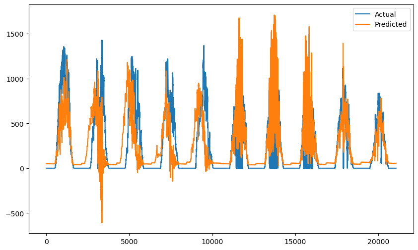
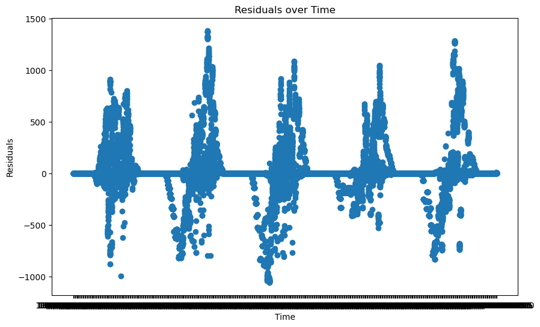

# Predicting Solar Power Generation

Using sensor data gathered at a plant level, the goal is to predict the power generation at the solar plant over the forthcoming days.
This forecast will be derived from historical generation data and sensor readings from two distinct power stations. This is a regression problem. 
In this scenario, the requirement is to predict a continuous output (A specific numeric quantity (the amount of power generated by the power generation of the solar plant)) based on a set of input features (AC, DC, Yield, ambient temperature, module temperature, and irradiation).

## DATA
A power generation set of data and a sensor set of data produced by two solar panel generation
plants in India are provided. The power generation datasets are gathered at the inverter level where
each inverter has multiple lines of solar panels attached to it. The data is in CSV format so is straight forward to work with. 
It consists of 140,000 rows of generation information. Here is the data definition from the source :
“This data has been gathered at two solar power plants in India over a 34 day period. It has two pairs
of files - each pair has one power generation dataset and one sensor readings dataset. The power
generation datasets are gathered at the inverter level - each inverter has multiple lines of solar
panels attached to it. The sensor data is gathered at a plant level - single array of sensors optimally
placed at the plant.” - ANI KANNAL, KAGGLE. 

Two models were used in the project, the purpose of which was to find the most suitable model to build, starting with simple foundations to more complex analysis. 
The first model used is a linear regression statistical model. It is a basic predictive
statistical model that assumes a linear relationship between independent (input) variables and a
dependent (output) variable. It doesn't inherently account for the time-dependent structure of the
solar data. However, it can be used in time series forecasting if the relationship between input and
output variables is indeed linear and if the features are engineered in such a way that they capture
the dependencies (for instance, by using lagged values of variables as inputs), all of which is
explored in this project.
The second model used is a Random Forest model. It is a machine learning model that uses decision
trees to make predictions. Unlike linear regression, it doesn't assume a linear relationship between
input and output variables, and it can capture complex interactions between variables. For this
project it will be used for regression. As it is typically more powerful than linear regression, it is also
more complex and can be harder to interpret. This model will be used once the linear regression
model has been fully explored.

Various techniques have been used to improve features of the Solar data provided to carry out the random forest regression. These include Interaction Features. Using the temperature readings features were formed by multiplying two (or more) existing features together. These capture effects between two variables that aren't considered in separately. Time-Series Specific Techniques. As the model is utilising with time series data, techniques specific such as lagging features are used.
Others were explored from the variety of optimisation techniques including:
• Feature Scaling
• Feature Selection
• Polynomial Features
• Regularization

## Exploratory Data Analysis (EDA)
Exploration of the data was done in four stages.

First some features were engineered for exploring. These were then built in as each model was done. Second some Basic Data Analysis was carried out to see if any patterns that could help with initial feature identification. This included combining data sets as well as modifying individual values. Thirdly Liner Regression was looked at as a form of modelling. This too utilized various combinations of features as well as plots to help get a deeper understanding of the data. Fourthly a Random Forest Regressor model was looked at and ultimately chosen.

Each approach was built on the observations of the previous. Other areas were explored including Auto-Regressive Integrated Moving Average (ARIMA) for time series forecasting.  However, this was discounted as the time series is not stationary due to the presence of a trend. i.e. Power Generation values vary over the day depending on the time. Methods to overcome this such as differencing or log transformations were looked but it was decided to explore other methods first as this can get extremely complex and difficult to tune.

### Basic Feature Engineering

Time series feature engineering techniques including lag features, rolling window features (average outputs over time), date and time features (hours, quarter hours), change features (how yields change % wise).

The following additional columns were added to the data to assist in exploratory analysis. The ultimate goal here is to find additional features that will benefit our forecasting.

·         Day – the day in the year
·         Hour – the hour in the day
·         DC Power Rounded – DC power rounded for simplified modelling and grouping
·         AC Power Rounded  – AC power rounded for simplified modelling and grouping
·         Ambient Temperature Rounded
·         Module Temperature Rounded
·         Power Generation – For the sake of simplicity we are using the formula AC + (DC-AC)/2
·         Power Generation One Hour Lag
·         Power Generation Two Hour Mean
·         Power Generation One Hour Change
·         Power Generation One Day Change

### Further Feature Assignments
Power
As a strategy the AC and DC outputs are combined into a single output "Power Generation" using the formula AC + (AC - DC) / 2. This is a single output for training purposes. For inputs the ambient temperature, module temperature and irradiation are used along with other values.

Since "Power Generation" is derived from AC and DC, AC And DC is included in the input parameters. This is to avoid overly optimistic performance metrics during model training, and poor performance on unseen data.

Generated features are created as lag features for "Daily Yield" and "Total Yield" because these are cumulative measurements and likely carry information from past to future. Total Yield One Day Lag will be used as its always increasing.  “Daily Yield” are used for the following features “Daily Yield Same Time Yesterday”,  “Daily Yield Rate of Change”, “Average Daily Yield Summary”

Some additional features were added for initial analysis purposes, these include generated features "Power Generated Two Hour Mean", "Power Generation One Hour Lag", "Power Generation One Day Change". These are ignored in favour of the yield patterns.

Temperature and Irradiation
In addition, interaction terms are aadded as features using the relationship of temperatures and irradiation to Power Generation. The following are also explored.

Ambient Temperature * Module Temperature: It could be the case that the effect of one temperature variable on power generation depends on the level of the other.

Temperature * Irradiation: The efficiency of solar panels can be influenced by the interaction between temperature and sunlight exposure. For example, at high irradiation levels, an increase in temperature might have a different effect on power generation than at low irradiation levels.

Temperature * Time of Day: The effect of temperature on power generation could vary at different times of the day. For instance, the impact of high temperatures might be different in the morning when the solar panels are just starting to receive sunlight, compared to midday when the sun is at its peak.

Time
The following features are explored.

Utilising timestamp information the time of day (hour and minute are available – every 15 minutes). For initial analysis the hour is being used. For MLM the Quarter Hour is used. Because of the cyclical nature of time and the volume of data the quarter hour is used along with Sin and Cos versions.

Year and month are not applicable as data only runs over 34 days. Seasonality will not be considered.

Time since first active, the time since the first positive reading occurs.

### Basic Data Analysis
Using a combination of Python and Excel some initial analysis of the data was carried out.

If you follow say the output at different temperatures for midday it shows the best results are at 27-28 degrees. This is interesting and should be targeted for optimisation.

## HYPERPARAMETER OPTIMSATION 
Linear Regression is a relatively straightforward model and doesn't have as many hyperparameters
to tune as the Random Forests model being used. In its most basic form, it actually has no
hyperparameters that need to be adjusted. It simply finds the line (or hyperplane in higher
dimensions) that best fits the data according to the least squares criterion.
For the Random Forest model the hyperparameters include the number of trees, the maximum
depth of the trees, and the minimum number of samples required to split a node.

Before tuning manually, a GridSearchCV from scikit-learn was used to automatically perform the hyperparameter tuning. Using different combinations of hyperparameters the idea is to find the best one using cross-validation. This is very time-consuming. The following is some settings used. 

param_grid = {
    'n_estimators': [50, 100],  # Number of trees in the forest
    'max_depth': [None, 10, 20],  # Maximum depth of the tree
    'min_samples_split': [2, 5],  # Minimum number of samples required to split an internal node
    'min_samples_leaf': [1, 2],  # Minimum number of samples required at each leaf node
    'bootstrap': [True]  # Number of features to consider when looking for the best split
}

Others were explored from the variety of optimisation techniques including
• Feature Scaling
• Feature Selection
• Polynomial Features
• Regularization

## RESULTS
The root mean squared error, mean absolute error and mean squared logarithmic error were used to understand how well the models were performing.

Various ways to improve the results were tried. First, increasing the number of decision trees in the forest led to better model generalization and reduced overfitting, resulting in lower RMSE and MAE. Additionally, tuning the hyperparameters such as the maximum depth of trees, minimum samples per leaf, and number of features considered for each split changed and optimized the model's predictive capabilities. Feature engineering and selection were also vital; identifying and incorporating relevant features as mentioned in the data sheet significantly impacted the model's performance. 

    Root Mean Squared Error: 259.4806680832404
    Mean Absolute Error: 127.27199505652949
    Mean Squared Logarithmic Error: 4.375979388777061
    Printing Comparison

