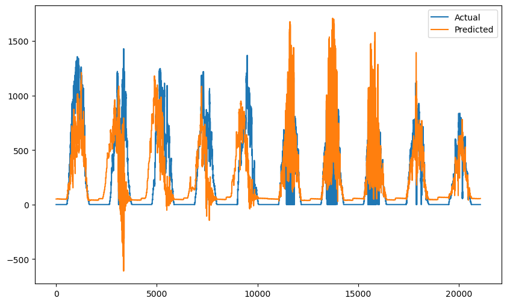
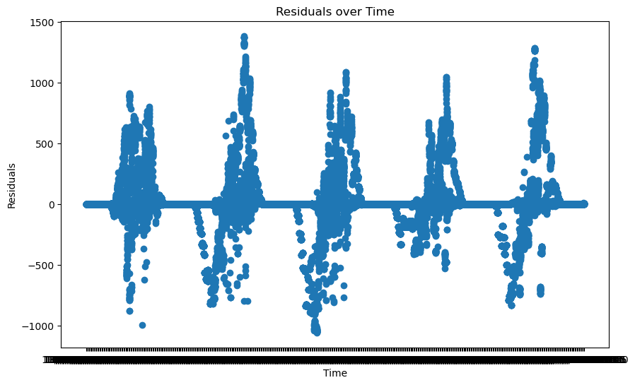
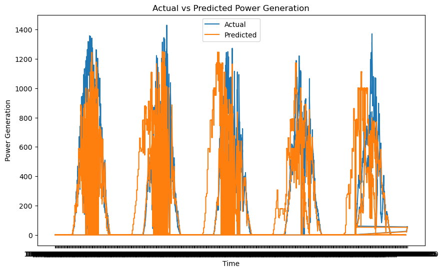
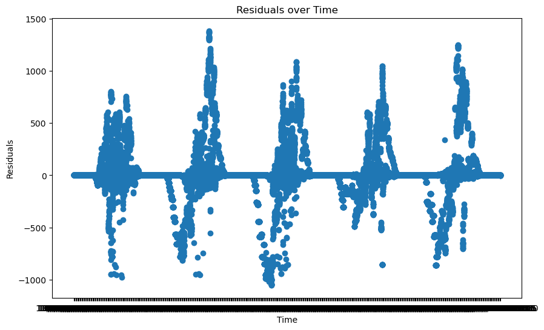

## Model Description

**Input:** 
'TimeInt', 'QuarterHour', 'HourSIN', 'HourCOS', 'DailyYieldSameTimeYesterdayDiff',
            'AverageDailyYieldSummary', 'DependentTemperature', 
            'TemperatureIrradiation', 'TemperatureTimeOfDay'

**Output:** 
"PowerGeneration"

**Model Architecture:** 
Two models are being used. The first is a linear regression statistical model. It is a basic predictive
statistical model that assumes a linear relationship between independent (input) variables and a
dependent (output) variable. It doesn't inherently account for the time-dependent structure of the
solar data. However, it can be used in time series forecasting if the relationship between input and
output variables is indeed linear and if the features are engineered in such a way that they capture
the dependencies (for instance, by using lagged values of variables as inputs), all of which is
explored.
The second model being used is Random Forest. It is a machine learning model that uses decision
trees to make predictions. Unlike linear regression, it doesn't assume a linear relationship between
input and output variables, and it can capture complex interactions between variables. For this
project it will be used for regression. As it is typically more powerful than linear regression, it is also
more complex and can be harder to interpret. This model will be used once the linear regression
model has been fully explored.

Various techniques have been used to improve features of the Solar data provided to carry out the random forest regression. These include Interaction Features. Using the temperature readings feature were formed by multiplying two (or more) existing features together. These can capture effects between two variables that aren't considered in a model that only includes each variable separately. Time-Series Specific Techniques. As the model is utilising with time series data, techniques specific such as lagging features were used.
Others were explored from the variety of optimisation techniques including:
 Feature Scaling
 Feature Selection
 Polynomial Features
 Regularization

## Performance

The root mean squared error, mean absolute error and mean squared logarithmic error were used to understand how well the model was performing.

On each run there were various ways of enhancing the results. First, increasing the number of decision trees in the forest lead to better model generalization and reduced overfitting, resulting in lower RMSE and MAE. Additionally, tuning the hyperparameters such as the maximum depth of trees, minimum samples per leaf, and number of features considered for each split can optimize the model's predictive capabilities. Feature engineering and selection were also vital; identifying and incorporating relevant features as mentioned in the data sheet significantly impacted the model's performance. 

Before tuning manually, a GridSearchCV from scikit-learn was used to automatically perform the hyperparameter tuning. Using different combinations of hyperparameters the idea is to find the best one using cross-validation. This is very time-consuming. The following is some settings used. 

param_grid = {
    'n_estimators': [50, 100],  # Number of trees in the forest
    'max_depth': [None, 10, 20],  # Maximum depth of the tree
    'min_samples_split': [2, 5],  # Minimum number of samples required to split an internal node
    'min_samples_leaf': [1, 2],  # Minimum number of samples required at each leaf node
    'bootstrap': [True]  # Number of features to consider when looking for the best split
}

The output from this is:

Fitting 5 folds for each of 24 candidates, totalling 120 fits
Best parameters: {'bootstrap': True, 'max_depth': 10, 'min_samples_leaf': 2, 'min_samples_split': 2, 'n_estimators': 100}
Making predictions...
Root Mean Squared Error: 260.81737266611174
Mean Absolute Error: 125.97784941411251
Mean Squared Logarithmic Error: 4.196805475579928
Printing Comparison
       Actual  Predicted
0         0.0  50.496746
1         0.0  50.496746
2         0.0  50.496746
3         0.0  50.496746
4         0.0  50.496746
...       ...        ...
21071     0.0  55.378416
21072     0.0  55.378416
21073     0.0  55.378416
21074     0.0  55.378416
21075     0.0  55.378416

[21076 rows x 2 columns]

## Limitations
- Model interpretability: While individual decision trees are easy to understand and interpret, a Random Forest model, can be quite complex and harder to interpret. This may make it difficult to explain the reasoning behind specific predictions.
- Training Time: this model can potentially be computationally expensive and time-consuming to train, especially when dealing with large datasets or a high number of trees. As a result, if the dataset was to increase in size, this may cause issues.
- Memory Usage: models like this can consume a lot of memory, especially if you're using many trees or the trees are very deep. If the dataset was to increase in size, this could potentially limit the use of random forests.
- Overfitting: Although Random Forests are generally less prone to overfitting compared to individual decision trees due to their ensemble nature, they can still overfit if you're not careful. This can happen when the model becomes too complex or when there is not enough noise in the bootstrapping process of creating the individual trees.

## Trade-offs
- Predictive Limitations: this dataset is not well-suited for extrapolation— so can't make predictions outside of the range of the training data. This may be problematic for time-series prediction where forecasting future trends that go beyond the existing data is often necessary.
- Handling High-dimensional sparse features: Random Forests can struggle with high-dimensional, sparse input features (eg, text data in bag-of-words), as the sparsity means that most trees in the forest will not be able to make effective splits. Therefore it may be limited to the format of this dataset.

